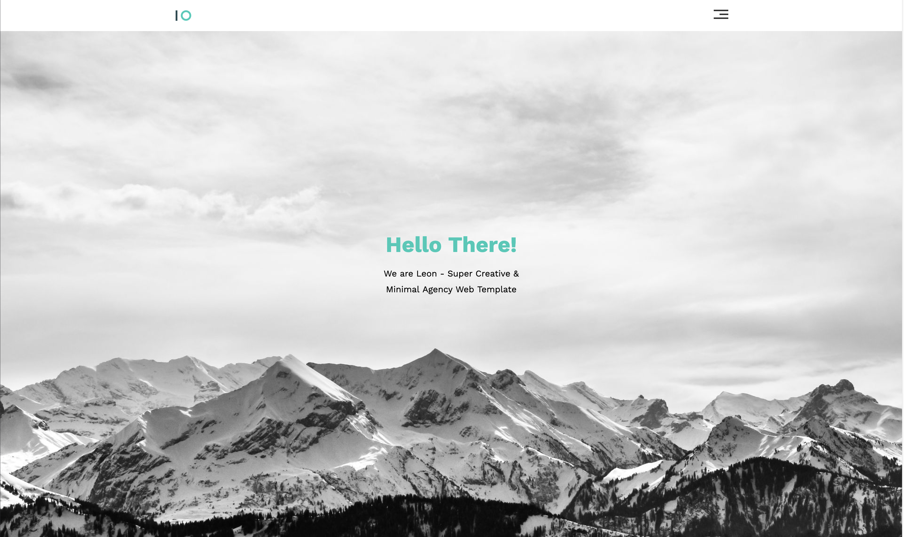
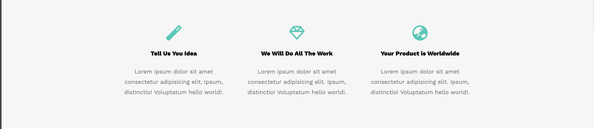
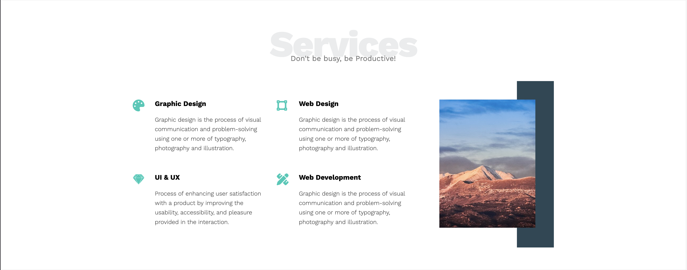
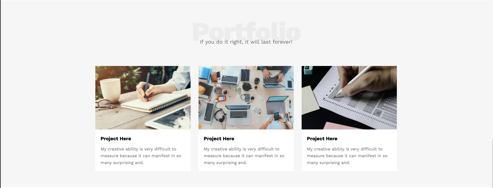
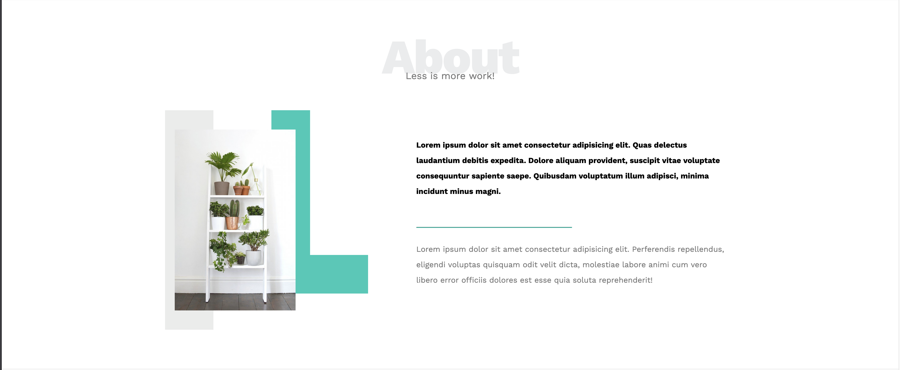
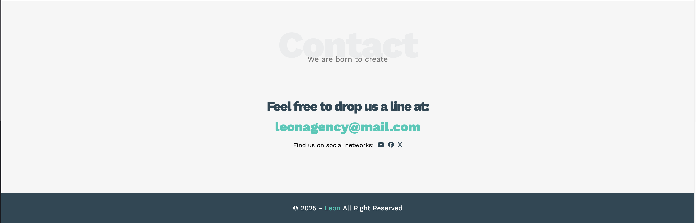

# Portfolio Landing Page Template (Static)

## [🔗 Live Demo Link](https://eslam-al-dabawi.github.io/html-css-template-one/) | [💾 Repository Link](https://github.com/Eslam-Al-Dabawi/html-css-template-one)

### 🌟 Project Goal

This project serves as a foundational exercise to showcase proficiency in core front-end layout and styling techniques. The primary objective was to build a visually clean, single-page professional portfolio template suitable for service industries.

### 🛠️ Technology Stack

- **HTML5:** Utilized for semantic structure, ensuring accessibility and SEO best practices.
- **CSS3:** Used for all styling and layout implementation, focusing on:
  - **Responsive Design:** Ensuring pixel-perfect rendering across various screen sizes (desktop, tablet, and mobile).
  - **Layout Management:** Applied techniques like **Flexbox** to handle element alignment and distribution efficiently.
- **Tools:** Git & GitHub for professional version control and live deployment.

### ✨ Key Features

- **Responsive Layout:** The design adapts seamlessly to all device resolutions using media queries.
- **Semantic HTML:** Code is structured using appropriate HTML5 elements (`<header>`, `<section>`, `<footer>`) for clarity and maintainability.
- **Clean and Organized CSS:** Styling rules are clearly commented and organized, reflecting a commitment to best coding practices.

---

### 🖼️ Visual Preview

Here is a visual preview of the key sections included in the template:








---

### 🚀 Setup & Installation (How to run it locally)

To view and test the project on your local machine:

1. **Clone the repository:**

   ```bash
   git clone [https://github.com/Eslam-Al-Dabawi/html-css-template-one.git](https://github.com/Eslam-Al-Dabawi/html-css-template-one.git)
    ```

2. **Navigate to the project directory:**

    ```Bash
    cd html-css-template-one
    ```

3. **Open the file:** Open the `index.html` file in your web browser.

### 💡 Future Enhancements (Next Steps)

- Integrate **JavaScript** for client-side interactions (e.g., smooth scrolling, contact form validation).

- Implement a **CSS framework** (e.g., Bootstrap or Tailwind CSS) to compare manual styling efficiency.